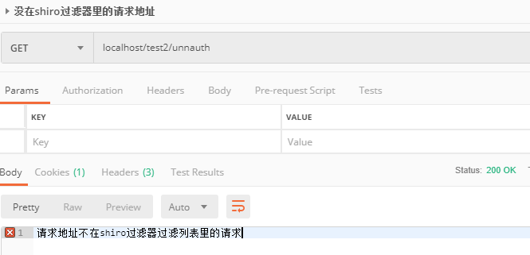
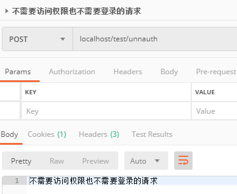
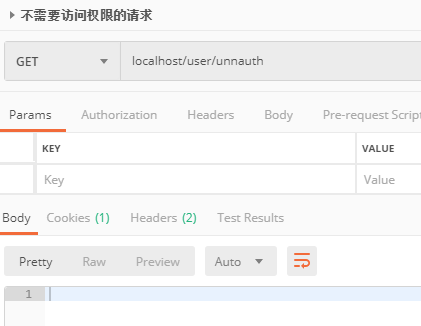
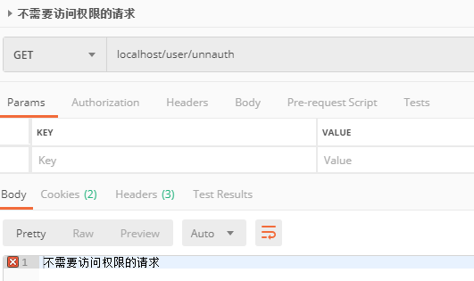
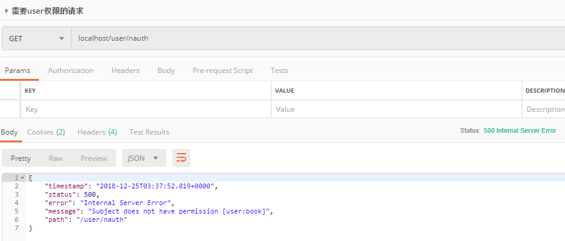

# shiro stateless
Demo of shiro session and stateless
安全框架shiro的一个同时支持无状态和session登录的添加部分自定义的demo

[完整demo项目github源码](https://github.com/t4Wang/shirostateless)

# 什么是shiro

 [官网地址](https://shiro.apache.org/)

`Shiro is a powerful and easy-to-use Java security framework that performs authentication, authorization, cryptography, and session management. With Shiro’s easy-to-understand API, you can quickly and easily secure any application – from the smallest mobile applications to the largest web and enterprise applications.`

shiro是一个java服务端控制访问权限的安全框架

# 使用场景
由于公司手机端不能存cookie，所以传统的session存储登录信息的登录方式（后面简称session登录）不能用，所以需要一个既支持session登录后访问有访问权限控制的url又支持无状态化夹带加密token访问有访问权限控制的url的shiro配置。

这个demo适合以下几类情形人员服用：

1. 面临上面我说的情况
2. 接触过shiro，接触过spring boot。但不知道具体shiro拦截的是怎么起到作用的
3. 接触过shiro，接触过spring boot。想把shiro 官方ini配置改写成java config配置的

这个demo不适合没有接触过shiro的人员，如果想要了解shiro基础的东西，推荐开涛的shiro的系列博客，地址
[开涛博客](https://jinnianshilongnian.iteye.com/blog/2018398) 你们看完后会发现我的一些代码也是参考他的。我开始用shiro也是先看文档后看开涛的博客然后又参考了一些别的博客，再自己打断点看shiro源码来摸索的。


# shiro默认访问步骤

shiro访问一个普通的url步骤大致是这样的

1. 到 shiro 的 PathMatchingFilter preHandle 方法判断一个请求的访问权限是可以直接放行还是需要 shiro 自己实现的AccessControlFilter 来处理访问请求
2. 假设到了 AccessControlFilter 实现类，首先在 isAccessAllowed 判断是否可以访问，如果可以则直接放行访问，如果不可以则到 onAccessDenied 方法处理，并继续调用 realm doGetAuthorizationInfo 授权判断是否有足够的权限来访问
3. 假设有足够的权限的话就访问到自己定义的 controller了

如果这个url是登录请求的话，
那接下来：

4. 在你自己的代码里会写到获取shiro的Subject，创建一个token，通常是UsernamePasswordToken，将请求参数的账户密码填充进去，然后调用subject.login(token)
5. 接下来到支持处理这个token的realm中调用 realm doGetAuthenticationInfo 鉴权，鉴权后，session中就存有你的登录信息了

# shiro开发步骤

原本shiro默认只支持session登录，不支持无状态形式的访问请求，只能做到阻止未登录用户访问需要访问权限的url，不符合我的需求。

要改的话就要看有没有一个东西来改变根据session控制访问逻辑。

可以实现 AccessControlFilter 来修改控制访问的逻辑

要做的有下面几方面
* [自定义实现AccessControlFilter （StatelessAuthcFilter）](#自定义实现AccessControlFilter)
* [shiro的过滤链上添加自定义的filter](#shiro的过滤链上添加自定义的filter)
* [自定义realm，不用账户密码登录鉴权（UsernamePasswordToken），而使用自定义的token传入加密字符串判断鉴权](#自定义realm)
* [自定义一个token（TokenRealm），存储参数和加密参数等](#自定义一个token)

## 自定义实现AccessControlFilter

自定义的filter继承AccessControlFilter类，主要改变了session登录判断是否登录的方式。AccessControlFilter有两个抽象接口，isAccessAllowed 和 onAccessDenied，如果isAccessAllowed返回true的话，就不会再判断用户是否有权限，所以isAccessAllowed直接返回false，在 onAccessDenied 方法里处理请求。

首先处理session登录方式的，*onAccessDenied* 方法有两个参数 *ServletRequest request, ServletResponse response*
用这两个参数可以获取subject，
``` java
Subject subject = getSubject(request, response);
if (subject.isAuthenticated()) return true;
```
如果已经登录，直接放行，就会继续授权，如果没有session信息，就继续向下判断是不是无状态方式的访问。

将请求参数填充自定义的 **StatelessToken** ，使用
``` java
subject.login(statelessToken);
```
让shiro调用自定义的 **TokenRealm** 来进行鉴权，鉴权通过的话，就和session登录的方式一样继续授权。

## shiro的过滤链上添加自定义的filter

自定义实现的filter需要在自定义的shiro java config 类到ShiroFilterFactoryBean先注册一个名字，然后在用这个名字添加到filterChainDefinitionMap去（如果只想用session登录的方式的话，不用自定义的filter，只需在filterChainDefinitionMap添加"auth"， 不需要控制权限的url添加"anon"就行）

```java
    @Bean
    public ShiroFilterFactoryBean shiroFilter(DefaultWebSecurityManager securityManager) {

        ShiroFilterFactoryBean shiroFilterFactoryBean = new ShiroFilterFactoryBean();
        shiroFilterFactoryBean.setSecurityManager(securityManager);

        Map<String, Filter> filters = new HashMap();
        filters.put("statelessAuthc", statelessAuthcFilter());
        shiroFilterFactoryBean.setFilters(filters);

        // 拦截器
        Map<String,String> filterChainDefinitionMap = new LinkedHashMap<>();

        //配置退出 过滤器,其中的具体的退出代码Shiro已经替我们实现了
        filterChainDefinitionMap.put("/login/logout", "logout");

        // 登录请求需要放行
        filterChainDefinitionMap.put("/login/sessionlogin", "anon");
        filterChainDefinitionMap.put("/login/statelesslogin", "anon");
        // 将想要纳入shiro statelessAuthc管理的放入map
        filterChainDefinitionMap.put("/user/*", "statelessAuthc");
        filterChainDefinitionMap.put("/**", "anon");
        shiroFilterFactoryBean.setFilterChainDefinitionMap(filterChainDefinitionMap);
        return shiroFilterFactoryBean;
    }
```
statelessAuthcFilter 是我的AccessControlFilter实现类。
在访问时，所有访问的请求都会被拦截并进入PathMatchingFilter preHandle，将放入filterChainDefinitionMap的pattern字符串取出和请求地址匹配。

## 自定义realm

有多个realm的话，在config里配置ModularRealmAuthenticator，将自己的realm添加进去。
在用到realm的时候，进入 ModularRealmAuthenticator doMultiRealmAuthentication 判断使用哪个realm。
首先调用
```java
public boolean supports(AuthenticationToken token)
```
判断这个realm是否支持，返回false的话shiro就不在这个realm上浪费时间了。调用完realm会根据配置时使用的调用策略来处理调用逻辑（是否继续调用，访问是否放行等）

有两个地方会调用到realm。一个是shiro 的 subject 调用login方法，根据token类型不同，会调用不同的realm的doGetAuthenticationInfo来鉴权；一个是调用AccessControlFilter实现类的onAccessDenied之后，如果判断用户可以继续访问就会继续调用realm的doGetAuthorizationInfo授权。

* 授权 doGetAuthorizationInfo：

    从数据库或缓存读取用户身份信息，判断用户是否有访问这个资源的权限，这个所有realm处理逻辑都一样

* 鉴权 doGetAuthenticationInfo

    session登录方式的鉴权只需要从数据库或缓存读取用户身份信息，判断密码是否正确，然后鉴权即可，无状态的登录方式需要[使用加密token](#使用加密token的原理) 鉴权。

## 自定义一个token

如果是账号密码登录的话，用shiro的UsernamePasswordToken就可以，但是因为需要在statelessAuthcFilter中调用login判断是否可以访问，所以需要增加一个支持自定义realm鉴权的token，这个token存储请求参数，用于tokenRealm鉴权对比前端加密token。

# 测试

接下来分别测试请求

1. 不在config类filterChainDefinitionMap里的请求地址



2. 在这个map里，过滤器anon（可以访问）的url



3. 在这个map里，自定义shiro过滤器statelessAuthc的url



4. session登录后访问不需要访问权限的请求



5. session登录后访问需要user权限的请求



6. 按自定义加密规则无状态化访问不需要user权限的请求


7. 按自定义加密规则无状态化访问需要user权限的请求


---

### 使用加密token的原理

将前端的参数拼接成一条字符串，使用加密函数加密，将这个加密字符串作为请求签名和之前的参数一起发送到后端，后端收到参数后把请求签名剔除出来，剩下的参数采用和前端相同的加密函数加密，加密后的字符串和请求签名对比是否一样，如果一样服务端就认为这条请求是有效的，就继续放行判断对应的用户是否有权限访问

这样即使别人截获正常用户的请求想要做自己的不当用途，他的参数加密后和签名字符串不匹配的话访问就会失败，一定程度上的排除了恶意用户

为了增加安全性，可以选择加服务端提供的随机字符串和时间戳和其他参数同时加密，我只是在服务端加了随机字符串

